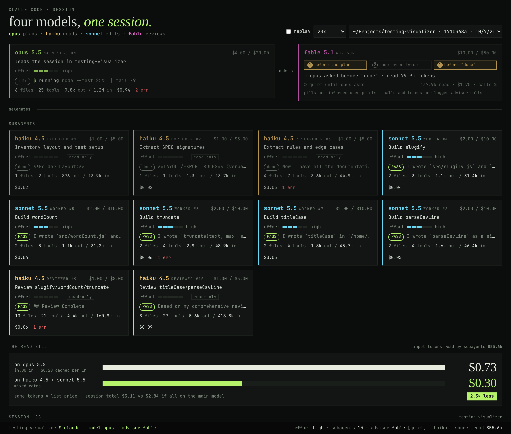

# agents-visualizer

Live dashboard of one coding-agent session: the main agent, its advisor and its subagents, with the model each one runs, what it is doing, token use and cost. Pick the agent harness from a dropdown.



*A real run: Opus 5.5 plans and reviews, Fable 5.1 advises at two checkpoints, and 10 subagents (Haiku 4.5 reads, Sonnet 5.5 edits) build a small library in 4m46s for $3.11.*

It only reads the session files each harness already writes, and never writes into them.

| Harness | Sessions read from |
|---|---|
| claude code | `~/.claude/projects/<project>/<sessionId>.jsonl`, with subagents in `<sessionId>/subagents/agent-<id>.jsonl` and `.meta.json` |
| oh-my-pi | `~/.omp/agent/sessions/<cwd>/<timestamp>_<id>.jsonl`, with subagents in the same-named folder as `<Name>.jsonl` |
| pi | `~/.pi/agent/sessions/--<cwd>--/<timestamp>_<id>.jsonl` (or `$PI_CODING_AGENT_DIR/sessions`); pi has no built-in subagents |
| opencode | the SQLite database `~/.local/share/opencode/opencode.db` (or `$OPENCODE_DB`); subagents are child sessions |

## Setup

You need Node 22.13 or later (opencode support uses Node's built-in SQLite), and Claude Code installed on the same computer, since the dashboard reads its transcripts. There is nothing to install.

```sh
git clone git@github.com:ebeltran1981/agents-visualizer.git
cd agents-visualizer
node --version   # v22 or later
```

## Use

Start the server, then open http://localhost:4321.

```sh
node server.js                       # opens the most recently modified session
node server.js --harness omp         # starts on another harness: claude (default), omp, pi or opencode
node server.js --session <id|path>   # opens a specific session
PORT=5000 node server.js             # uses another port
CLAUDE_CONFIG_DIR=/path/to/config node server.js   # if Claude Code's config isn't in ~/.claude
```

- **Pick a harness** with the first dropdown in the top right. It lists only the harnesses installed on this computer: those whose CLI (`claude`, `omp`, `pi`, `opencode`) is on `PATH` or whose data folder exists. `--harness` adds one regardless. Then **pick a session** with the second. It lists that harness's 40 most recent sessions on this computer, labelled by project folder and session id. A harness with no sessions says where it looked.
- **Live sessions** stream in as Claude Code writes them. Leave the dashboard open while you work in another terminal.
- **Finished sessions** replay by default (any session quiet for 60 s). Choose 5x, 20x or 100x, or "instant" to load everything at once. Untick "replay" to load without playback.
- **URL parameters** make a view shareable or scriptable: `?session=<path>&replay=1&speed=20`.

What the dashboard shows:

| Panel | Meaning |
|---|---|
| Header | How many models the session used, and what each one did (plans, reads, edits, reviews). |
| Main session | The main agent's model, effort, current activity, files, tools, tokens and cost. |
| Advisor | The advisor model, its three checkpoint pills, the number of real advisor calls, and the tokens and cost of those calls. |
| Subagents | One card per subagent: model, type, effort, activity and state (working, idle, done, PASS or FAIL). |
| The read bill | What the subagents' reading cost on their own models, compared with the same tokens on the main model. |
| Session log | Every tool call, message, error and advisor call, with timestamps and day dividers. |
| Footer | The reconstructed command line, the effort levels, the subagent count and the advisor's state. |

## Getting a multi-model session

The dashboard is most useful when a session mixes models. In the project you are working on:

1. **Give each subagent role its own model** in `.claude/agents/<name>.md`:

   ```markdown
   ---
   name: explorer
   description: Read-only. Searches and reads the codebase and reports what it found.
   model: claude-haiku-4-5
   tools: Read, Grep, Glob
   ---

   You are a read-only explorer. Report file paths and facts, never edit files.
   ```

   A `worker` with `model: claude-sonnet-5-5` and edit tools makes a good companion. Ask workers and reviewers to end their final message with a line containing only `PASS` or `FAIL`; the cards key on that line.

2. **Turn on the advisor** with `/advisor` inside Claude Code, or set `"advisorModel": "fable"` in `~/.claude/settings.json`.

3. **Start the main session** on the model you want to lead, for example `claude --model opus --effort high`, and ask it to delegate to those subagents.

## Status line

`statusline.js` reads Claude Code's status-line JSON on stdin and prints one line, for example:

```
opus ● thinking · sonnet ✎ editing · haiku ▸ 38 files │ $0.12 vs $4.96
```

The two numbers are the session cost and what it would cost if every agent ran on the main model. Add it to `~/.claude/settings.json`, using the absolute path of your clone:

```json
{ "statusLine": { "type": "command", "command": "node /path/to/agents-visualizer/statusline.js" } }
```

## Prices

Costs come from the `PRICES` table at the top of `aggregate.js`: Anthropic list prices in USD per 1M tokens (input, output, cache read, 5-minute cache write).

For your own rates or other models, copy `prices.local.example.json` to `prices.local.json` next to `server.js`. Git ignores that file, so company rates never reach the repo. Entries there take precedence over `PRICES`, and the dashboard and the status line both read it. Reload the page after editing it.

The example below uses placeholder rates; replace them with yours.

```json
{
  "company-large": { "in": 3, "out": 15, "label": "large", "family": "large" },
  "company-small": { "in": 0.5, "out": 2, "cacheRead": 0.05 },
  "claude-opus-5-5": { "in": 3.6, "out": 18, "cacheRead": 0.18, "cacheWrite": 4.5 }
}
```

- Keys match model IDs as they appear in the transcripts, by prefix.
- `in` and `out` are required. `cacheRead` and `cacheWrite` default to `in`.
- `label` changes the name on the cards, and `family` changes the name used in the header and footer.
- If the file isn't valid JSON, the server logs why in its terminal and ignores it.

A model with no price shows `?`. Its tokens are left out of both sides of every cost comparison, and the session total shows as `≥ $…` so you know it's incomplete.

## Company gateways and non-Claude models

The dashboard reads the transcripts Claude Code writes on your computer, so it works the same whether Claude Code talks to Anthropic directly or through a company gateway.

- **Provider prefixes and suffixes are stripped** before matching prices and names, so `us.anthropic.claude-opus-5-5-v1:0` and `claude-haiku-4-5@20251001` are recognised as Opus 5.5 and Haiku 4.5.
- **Non-Claude models** appear under their own name (for example "gpt-5 edits"), in a neutral colour, and need an entry in `prices.local.json` to be priced.
- **The advisor is a server-side Anthropic tool.** Without an advisor, the card reads "no advisor" and counts 0 calls, but the checkpoint pills still light from plan mode, repeated errors and turn ends. Whether the advisor works through your gateway depends on its backend.

## Files

| File | Purpose |
|---|---|
| `server.js` | Streams the selected harness's session over SSE (`/events`). Also serves `/api/harnesses` and `/api/sessions`. |
| `harnesses/*.js` | One adapter per harness: lists its sessions and turns its files into the shared record format. |
| `aggregate.js` | Harness-agnostic aggregation and the price table. The browser and `statusline.js` both use it. |
| `prices.local.example.json` | Template for your own rates and model names; copy it to `prices.local.json`. |
| `index.html` | The dashboard, written in vanilla JS and CSS. |
| `statusline.js` | The one-line status line. |

## Notes

- Usage is counted once per API message, because Claude Code repeats `usage` on every content-block line.
- A subagent counts as **done** when its last message is text-only or it calls `SubagentHandback`. It shows **PASS** or **FAIL** when the last line of its final message is exactly that word. It counts as **idle** after 45 s with no activity.
- Advisor calls appear in transcripts as a `server_tool_use` block named `advisor`. Their tokens appear only in `usage.iterations` (type `advisor_message`, with the advisor's model), not in the top-level usage, so the dashboard adds them separately at the advisor's price.
- The checkpoint pills are inferred. A real advisor call lights "before the plan" if no subagent has started yet, "same error twice" if a tool error just repeated, and "before done" if every subagent has finished. `EnterPlanMode`, repeated errors and turn ends also count.
- The footer's command line is reconstructed from the transcript's model and effort.
- **oh-my-pi** records the cost of each message itself. The dashboard uses that unless `prices.local.json` has the model. Subagents are named after their file (for example "BackendArch") and get their agent type (for example "scout") once the parent's `task` call returns. They count as done when they call `yield`, and show PASS or FAIL when its data has that status or result. With `--advisor`, the advisor's own transcript (`__advisor.jsonl`) feeds the advisor panel: each finished review is one call. A failed model call (say, a retired model) shows as an error and marks the agent FAIL. Not yet counted: the small cost of omp's automatic thinking-level judge.
- **pi** uses the same parser as oh-my-pi. Sessions saved with `--session-dir` or a custom `sessionDir` setting aren't listed. Checked on a real pi 1.1.0 session: its tokens and tool calls match pi's own file exactly. pi records the cost it knows; models added in `~/.pi/agent/models.json` without a `cost` show as $0.00.
- **opencode** sessions are read from its SQLite database without writing to it. While opencode is running, the dashboard opens the database read-only and sees new rows as they land. Otherwise it opens the file as immutable, so no `-wal` or `-shm` files are created next to it. Costs come from opencode's own per-step pricing unless `prices.local.json` has the model; opencode doesn't split cost into input and output, so its subagents appear in the read bill only when the price table knows their model. Checked on a real 10-subagent run: its token totals match opencode's own session totals exactly.
- If the server restarts or a session file is rewritten, the page reconnects and rebuilds from scratch, so nothing is counted twice.
